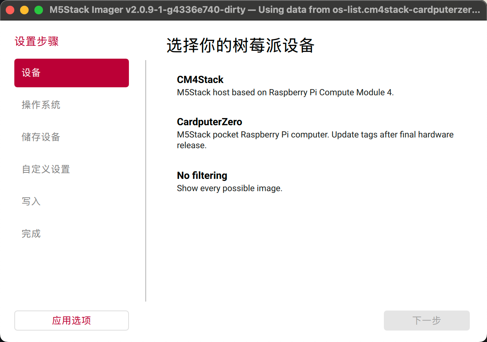

# M5Stack Imager

M5Stack Imager is an M5Stack-oriented fork of Raspberry Pi Imager for writing
operating-system images to M5Stack Raspberry Pi devices such as CM4Stack and
CardputerZero.

This repository currently keeps the upstream Qt/C++ writing engine, removable
drive handling, checksum verification, OS customisation flow, and Compute
Module USB boot support from Raspberry Pi Imager. The first M5Stack-specific
layer is the default branding, telemetry policy, and OS repository structure.

## Preview



## Upstream

The upstream project is `raspberrypi/rpi-imager` and remains available as the
`upstream` git remote:

```sh
git remote -v
git fetch upstream
```

The original upstream README is preserved in `README.upstream.md`. Keep
`license.txt` and upstream copyright notices intact when distributing builds.

## M5Stack Repository Manifest

The app reads an OS list JSON manifest. The default is configured in `src/config.h`
through `M5STACK_IMAGER_DEFAULT_REPO_URL`:

```text
qrc:/m5stack/os-list.json
```

That default embeds the checked-in example manifest at
`m5stack/os-list.cm4stack-cardputerzero.example.json`, so early test builds do
not depend on a published CDN endpoint. When the production manifest endpoint is
ready, either change the CMake default or build with:

```sh
cmake -S src -B build \
  -DM5STACK_IMAGER_DEFAULT_REPO_URL=https://m5stack.oss-cn-shenzhen.aliyuncs.com/resource/linux/m5stack-imager/os_list_v1.json
```

You can also test a local or remote manifest at runtime:

```sh
rpi-imager --repo m5stack/os-list.cm4stack-cardputerzero.example.json
```

That example exposes CM4Stack and CardputerZero in the device picker and uses
the current CM4StackOS canary images plus Raspberry Pi OS image URLs as
known-good starter entries. Replace the placeholder icon URL and add
CardputerZero images once release images and SHA256 values are available.

Use the normal M5Stack OSS path style for production images, for example:

```text
https://m5stack.oss-cn-shenzhen.aliyuncs.com/resource/linux/cp0/raspi-shrink.img.zip
```

## Build

Use the upstream build flow for now:

```sh
cd src
cmake -S . -B ../build -DCMAKE_BUILD_TYPE=RelWithDebInfo
cmake --build ../build
```

Linux AppImage and macOS DMG flows are still the upstream flows. The Windows
installer can be built by GitHub Actions from this repository.

## GitHub Actions and Releases

`.github/workflows/windows-release.yml` builds an unsigned Windows x64 package
on `push`, `pull_request`, and manual `workflow_dispatch`.

The workflow produces:

- `M5Stack-Imager-<version>-windows-x64-installer.exe`
- `M5Stack-Imager-<version>-windows-x64-portable.zip`

To publish a GitHub Release, push a version tag:

```sh
git tag v0.1.0
git push origin v0.1.0
```

The release job creates or updates the matching GitHub Release and uploads the
Windows installer plus portable zip. Builds are unsigned until M5Stack code
signing credentials are wired into the workflow, so Windows may show the normal
SmartScreen warning.

Packaging identifiers such as `com.raspberrypi.rpi-imager`, `rpi-imager`, and
`.rpi-imager-manifest` still need a dedicated M5Stack rename pass before public
release.

## Immediate TODO

- Publish the production M5Stack OS manifest and replace the placeholder URL if
  the CDN path changes.
- Add official CM4Stack and CardputerZero icons to the manifest.
- Decide whether M5Stack wants its own anonymous metrics endpoint; telemetry is
  disabled by default in this fork.
- Add M5Stack-specific first boot customisation only after the target image
  layout is fixed.
